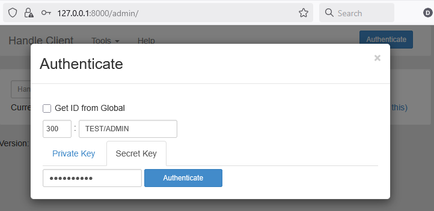
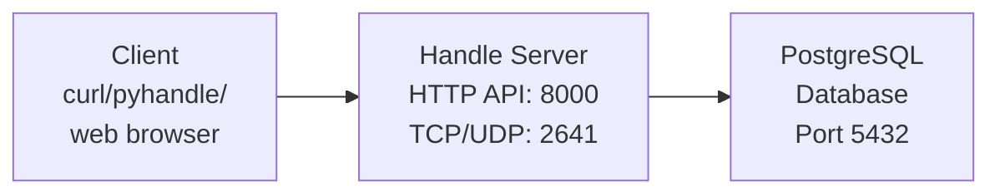
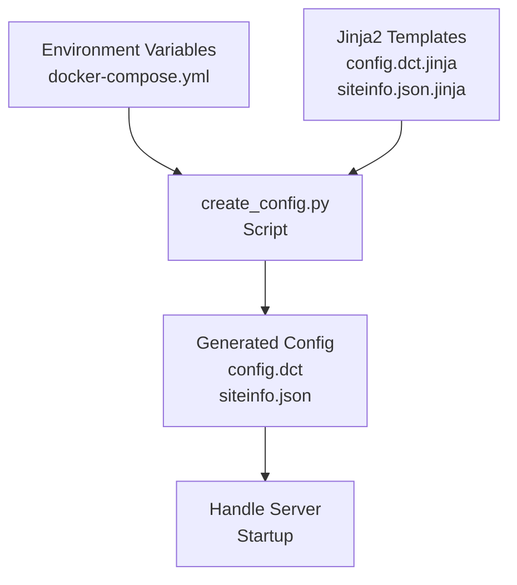

# PID4CAT Handle Development Server

This repository provides a Docker-containerized setup for running Handle Server software for development and testing purposes on your local system or in CI.

The Handle Server software itself is from <http://www.handle.net/>. For official documentation, production deployment guidance, and support, please refer to the Handle.Net documentation and support channels.

This Docker setup includes:

- Handle Server environment with PostgreSQL backend
- Automated configuration scripts that load settings from environment variables  
- Development credentials and examples

Documentation included here:

- Markdown version of [HANDLE.NET (Ver. 9) Technical Manual](./handle_net_documentation/HN_Tech_Manual_9.md)
- Markdown version of [Release Notes Handle.Net Version 9.3.2 Software](./handle_net_documentation/HN_v9.3.2_ReleaseNotes.md)

Other source of information:

- Documentation of [pyhandle](https://eudat-b2handle.github.io/PYHANDLE/) library and its [GitHub-repo](https://github.com/eudat-b2handle/PYHANDLE)

## Getting Started

### Step 1: Generate Keypair

The Handle Server requires PKCS8 format RSA keys for encryption as documented in the Handle.Net Technical Manual, [Section 1.4.1 "Types of Authentication"](./handle_net_documentation/HN_Technical_Manual_9.md#141-types-of-authentication).
Generate them first before configuring the environment.

**Note for Windows users**: Use Git Bash for OpenSSL commands, as OpenSSL is not available in PowerShell by default.

```bash
# Generate private key in default PKCS8 format
openssl genpkey -algorithm RSA -out mykey.pem

# Extract public key
openssl pkey -in mykey.pem -pubout -out mykey.pem.pub
```

### Step 2: Configure Environment

Before starting the containers, configure any environment settings and provide the keys you generated in Step 1.
They should be added each in a single line to `docker-compose.yaml` file.

To convert the keys into the required format, run in git bash:

```bash
# Private key
 openssl pkcs8 -topk8 -in mykey.pem -nocrypt | sed ':a;N;$!ba;s/\n/\\r\\n/g'

# Public key
openssl pkcs8 -topk8 -in mykey.pem -nocrypt | openssl pkey -pubout | sed ':a;N;$!ba;s/\n/\\r\\n/g'
```

For more on overriding env variables see [Environment variables in Compose](https://docs.docker.com/compose/environment-variables/).

#### Required Configuration

| Config                        | Default       | Required  | Description
| ------                        | -------       | --------  | -----------
| SERVER_PRIVATE_KEY_PEM        | None          | **Yes**   | PEM PKCS8 format private key from Step 1
| SERVER_PUBLIC_KEY_PEM         | None          | **Yes**   | PEM PKCS8 format public key from Step 1

#### Optional Configuration

All configuration values have sensible defaults.
You only need to modify these if you want to customize the setup:

**Interface Configuration**

| Config                        | Default       | Required  | Description
| ------                        | -------       | --------  | -----------
| BIND_ADDRESS                  | 0.0.0.0       | No        | IP address to bind server interfaces to (HTTP, TCP, UDP)
| NUM_THREADS                   | 15            | No        | Number of threads for TCP/UDP interfaces
| BIND_PORT                     | 2641          | No        | Port for TCP/UDP Handle protocol
| LOG_ACCESSES                  | yes           | No        | Log access requests to interfaces
| HTTP_BIND_PORT                | 8000          | No        | Port for HTTP interface
| HTTP_NUM_THREADS              | 15            | No        | Number of threads for HTTP interface
| BACKLOG                       | None          | No        | Network backlog queue size
| BIND_ADDRESS_V6               | None          | No        | IPv6 bind address
| LISTEN_ADDRESS                | None          | No        | Address to listen on (different from bind)
| ALLOW_RECURSION               | None          | No        | Allow recursive handle resolution

**Server Configuration**

| Config                        | Default       | Required  | Description
| ------                        | -------       | --------  | -----------
| SERVER_ADMINS                 | None          | No        | Space-separated list of handle admins e.g. "ADMIN1 ADMIN2 ADMIN3"
| REPLICATION_ADMINS            | None          | No        | Space-separated list of handle admins for replication e.g. "ADMIN1 ADMIN2 ADMIN3"
| MAX_SESSION_TIME              | 86400000      | No        | Max authenticated client session time in milliseconds
| THIS_SERVER_ID                | 1             | No        | An identifier for this handle server
| MAX_AUTH_TIME                 | 60000         | No        | Max time to wait for client to respond to auth challenge in milliseconds
| SERVER_ADMIN_FULL_ACCESS      | yes           | No        | Admins listed in SERVER_ADMINS will have full permissions over all handles on the server
| ALLOW_NA_ADMINS               | no            | No        | Allow global handle server admins access to this handle server
| TEMPLATE_NS_OVERRIDE          | yes           | No        | Allow template namespace override
| CASE_SENSITIVE                | no            | No        | Are handles case sensitive
| AUTO_HOMED_PREFIXES           | TEST          | No        | Space-separated list of prefixes that are auto-homed e.g. "0.NA/TEST PREFIX2"
| MAX_HANDLES                   | None          | No        | Maximum number of handles the server will store
| MAX_VALUES                    | None          | No        | Maximum number of values per handle
| TRACE_RESOLUTION              | None          | No        | Enable resolution tracing for debugging
| ALLOW_LIST_HDLS               | None          | No        | Allow listing handles under a prefix

**Protocol Settings**

| Config                        | Default       | Required  | Description
| ------                        | -------       | --------  | -----------
| NO_UDP_RESOLUTION             | yes           | No        | Set to "no" to enable UDP protocol support

**Logging Configuration**

| Config                        | Default       | Required  | Description
| ------                        | -------       | --------  | -----------
| LOG_SAVE_INTERVAL             | Never         | No        | How often to save logs (Never, Weekly, Monthly, etc.)
| LOG_SAVE_DIRECTORY            | logs          | No        | Directory to save log files

**Site Information**

| Config                        | Default       | Required  | Description
| ------                        | -------       | --------  | -----------
| HANDLE_HOST_IP                | 0.0.0.0       | No        | Public handle host IP used for siteinfo
| SITE_DESCRIPTION              | Handle Server | No        | Description text for the server in siteinfo.json

**Storage Configuration**

| Config                        | Default       | Required  | Description
| ------                        | -------       | --------  | -----------
| STORAGE_TYPE                  | sql           | No        | Storage backend type - set to "sql" for PostgreSQL storage
| SQL_URL                       | None          | No        | JDBC URL that is used to connect to the PostgreSQL database
| SQL_DRIVER                    | org.postgresql.Driver | No | Java class that contains the driver for the JDBC connection
| SQL_LOGIN                     | postgres      | No        | User name for database connection
| SQL_PASSWD                    | None          | No        | Password for database connection
| SQL_READ_ONLY                 | no            | No        | Boolean setting for allowing writes to database or not

**HTTP Configuration**

| Config                        | Default       | Required  | Description
| ------                        | -------       | --------  | -----------
| ALLOW_CORS                    | None          | No        | Enable CORS for HTTP interface
| CORS_ORIGINS                  | None          | No        | Allowed CORS origins
| HTTPS_ENABLED                 | None          | No        | Enable HTTPS support
| HTTPS_PORT                    | None          | No        | Port for HTTPS interface
| HTTP_LOG_FORMAT               | None          | No        | HTTP access log format
| MAX_REQUEST_SIZE              | None          | No        | Maximum HTTP request size
| SESSION_TIMEOUT               | None          | No        | HTTP session timeout
| ADMIN_PATH                    | None          | No        | Custom path for admin interface

### Step 3: Start the Handle Server

Start the containers from the project root:

```bash
docker compose up --build
```

**Note:** The handle_server container build process can take several minutes as it downloads and compiles Java components. To speed up subsequent startups, you can pre-build the handle_server image:

```bash
# Pre-build the handle_server image (recommended for faster startup)
docker compose build handle_server

# Then start normally
docker compose up
```

Wait for the containers to start up completely.
You should see log messages indicating the Handle Server is ready and listening on ports 2641 (TCP/UDP) and 8000 (HTTP/HTTPS).

### Step 4: Test the Setup

#### Reading Handles with curl

Test read access to existing handles:

```bash
# Read admin handle
curl -k "https://127.0.0.1:8000/api/handles/TEST/ADMIN?pretty=yes"

# Read any handle
curl -k "https://127.0.0.1:8000/api/handles/TEST/EXAMPLE001?pretty=yes"
```

- `-k`: Tell curl to accept self-signed SSL certificates
- `?pretty=yes`: Query parameter to get JSON-formatted response

More options are documented in the Handle.Net Technical Manual [section 14.1 Resources](./handle_net_documentation/HN_Technical_Manual_9.md#141-resources).

#### Database Access

Inspect handles directly in the PostgreSQL database (for development only):

```bash
# Connect to PostgreSQL database
docker exec -it pid4cat-handle-dev-server-postgres-1 psql -U handleuser -d handledb

# View handles in readable format
SELECT encode(handle, 'escape') as handle_name, idx, type, encode(data, 'escape') as data_value 
FROM handles WHERE handle LIKE decode('544553542f', 'hex') || '%' ORDER BY handle;
```

## Usage

### Creating Handles with curl

For creating handles, authentication is required. The simplest and most reliable method is **Basic Authentication** as documented in the Handle.Net Technical Manual [section 14.6.3 Basic Access Authentication](./handle_net_documentation/HN_Technical_Manual_9.md#1463-basic-access-authentication).

This method uses standard HTTP Basic Authentication with percent-encoded username:

1. **Create handle data file** (`handle_data.json`):

   ```json
   {
     "values": [
       {
         "index": 1,
         "type": "URL",
         "data": {
           "format": "string",
           "value": "https://example.org/mydata"
         }
       },
       {
         "index": 100,
         "type": "HS_ADMIN",
         "data": {
           "format": "admin",
           "value": {
             "handle": "TEST/ADMIN",
             "index": 300,
             "permissions": "011111110011"
           }
         }
       }
     ]
   }
   ```

2. **Create handle with curl**:

   ```bash
   curl --insecure -v -X PUT "https://127.0.0.1:8000/api/handles/TEST/MY_NEW_HANDLE" \
     -H "Content-Type: application/json" \
     -u "300%3ATEST%2FADMIN:ASECRETKEY" \
     --data-binary "@handle_data.json"
   ```

   **Key points:**
   - Username `300:TEST/ADMIN` is percent-encoded as `300%3ATEST%2FADMIN`
   - Colon (`:`) becomes `%3A`
   - Forward slash (`/`) becomes `%2F`
   - Password is the secret key: `ASECRETKEY`

3. **Success response:**

   ```json
   {"responseCode":1,"handle":"TEST/MY_NEW_HANDLE"}
   ```

This method is reliable, simple, and works consistently across different platforms and curl versions.

### Using PyHandle Library

The [PyHandle](https://pypi.org/project/pyhandle/) library provides a Python interface that implements the challenge-response framework with digital signatures (uses HS_PUBKEY).
This complex authentication mechanism cannot be applied with curl alone. It is documented in the Handle.Net Technical Manual, [Section 14.6.4 and following](./handle_net_documentation/HN_Technical_Manual_9.md#1464-authentication-via-authorization-handle).

```bash
# Activate virtual environment (if using one)
.\.venv\Scripts\Activate.ps1   # Windows PowerShell
# or
source .venv/bin/activate      # Unix/Linux

# Run the example script
python examples/create_handle_examples.py
```

### Accessing the Web Admin GUI

The dockerized Handle Server provides a web-based administration interface for managing handles through a graphical user interface.

**Access URL:** `https://127.0.0.1:8000/admin/`

**Login Credentials:**

- **Username:** `300:TEST/ADMIN`
- **Password:** `ASECRETKEY`

The web interface allows you to:

- View existing handles
- Create new handles
- Modify handle values
- Home/Unhome Prefixes

  

  **Note:** The web admin interface uses username/password authentication (HS_SECKEY) and does not require certificate files.

## Architecture

The dockerized Handle Server consists of three main components:



**Component Details:**
- **PostgreSQL**: Stores handles in `handles` and `nas` tables with proper indexing
- **Handle Server**: Java application that processes Handle protocol requests
- **Configuration System**: Jinja2 templates generate server config from environment variables
- **Web Interface**: Built-in admin GUI accessible via HTTPS

### File Structure
```
pid4cat-handle-dev-server/
├── docker-compose.yml              # Container orchestration
├── handle-server/                  # Handle server container
│   ├── Dockerfile                  # Container build instructions
│   ├── config/                     # Configuration templates
│   │   ├── config.dct.jinja       # Main server config Jinja2 template
│   │   └── siteinfo.json.jinja    # Server metadata Jinja2 template
│   ├── scripts/                    # Build and startup scripts
│   │   ├── create_config.py       # Jinja2 config generation from env vars
│   │   └── handle.sh              # Container startup script
│   └── storage/
│       └── init_db.sql            # Database initialization
└── examples/                       # Usage examples
    ├── create_handle_examples.py   # PyHandle library demo
    └── credentials.json            # PyHandle credentials
```

## Configuration System

The Handle Server configuration is generated dynamically from environment variables using Jinja2 templates:

### How It Works
1. **Environment Variables** → Set in `docker-compose.yml`
2. **create_config.py Script** → Reads env vars and processes Jinja2 templates
3. **Template Files** → `.jinja` files with `{{ variable }}` placeholders
4. **Final Config** → Generated `.dct` and `.json` files used by server

### Configuration Flow



### Key Configuration Files

| File | Purpose | Variables Used |
|------|---------|----------------|
| `config.dct.jinja` | Main server settings | `{{ BIND_ADDRESS }}`, `{{ SERVER_ADMINS }}`, `{{ SQL_URL }}`, etc. |
| `siteinfo.json.jinja` | Server metadata for Handle protocol | `{{ HANDLE_HOST_IP }}`, `{{ SERVER_PUBLIC_KEY_DSA_BASE64 }}` |

### Startup Process
1. Container starts → `handle.sh` script runs
2. `create_config.py` executed: `python3 create_config.py /opt/handle/bin /var/handle/svr`
3. Jinja2 templates processed → Final config files generated
4. Keys converted from PEM to DSA format using `hdl-convert-key`
5. Handle Server starts with generated configuration

### Testing Configuration Script

The `create_config.py` script includes unit tests that can be run locally:

```bash
cd handle-server/scripts
python -m unittest test_create_config.py
```

Tests cover configuration building, template rendering, and error handling using Python's standard library with minimal dependencies (requires `jinja2`).

## Troubleshooting

### Common Issues

**Database Errors: `relation "nas" does not exist`**
```bash
# Solution: Reset database and restart
docker compose down
docker volume rm pid4cat-handle-dev-server_postgres_data
docker compose up --build
```

**File Path Errors: `No such file or directory`**  
Check that file paths in `docker-compose.yml` match actual file locations after recent moves.

**Configuration Not Applied**  
Environment variables are only read during container build. After changing `docker-compose.yml`, run:
```bash
docker compose up --build
```

**SSL Certificate Warnings**  
Normal for development. Use `-k` flag with curl: `curl -k https://127.0.0.1:8000/...`

### Quick Commands Reference
```bash
# Essential operations
docker compose up --build          # Start with rebuild
docker compose down                # Stop all services  
docker compose logs -f handle_server # View server logs
docker volume ls                   # List volumes
docker exec -it <container> bash   # Access container shell

# Testing
curl -k "https://127.0.0.1:8000/api/handles/TEST/ADMIN?pretty=yes"
python examples/create_handle_examples.py
```

### Development Checklist
- [ ] Docker and Docker Compose installed
- [ ] Remove old volume: `docker volume rm pid4cat-handle-dev-server_postgres_data` (if restarting)
- [ ] Start services: `docker compose up --build`  
- [ ] Wait for PostgreSQL "ready to accept connections" message
- [ ] Test API: `curl -k "https://127.0.0.1:8000/api/handles/TEST/ADMIN?pretty=yes"`
- [ ] Access web admin: https://127.0.0.1:8000/admin/ (300:TEST/ADMIN / ASECRETKEY)

## Technical Notes

- **TEST Prefix**: Configured for local development and testing only. Handles created with TEST prefix are not globally resolvable. They are restricted to your local setup.
- **Database Storage**: All handles are stored in PostgreSQL with proper indexing and transaction support.
- **Ports**: Handle Server listens on 2641 (TCP/UDP native protocol) and 8000 (HTTP/HTTPS REST API).
- **Security**: Uses hardcoded development keys and credentials. Generate your own keys for production use.

## Acknowledgement

[datacite/docker-handle](https://github.com/datacite/docker-handle) was very helpful to figure out details.
Here we use more flexible jinja2-templating, support only PostgrSQL for storage and use the latest Handle.Net software (v9.3.2).

Created with assistance from Claude Sonnet 4 (Anthropic, accessed August 2025) and Gemini 2.5 Pro (Google, accessed August 2025) via the Claude Code command-line interface, GitHub co-pilot in Visual Studio Code and Warp.
All AI-generated code was reviewed, tested, and validated by the authors.
